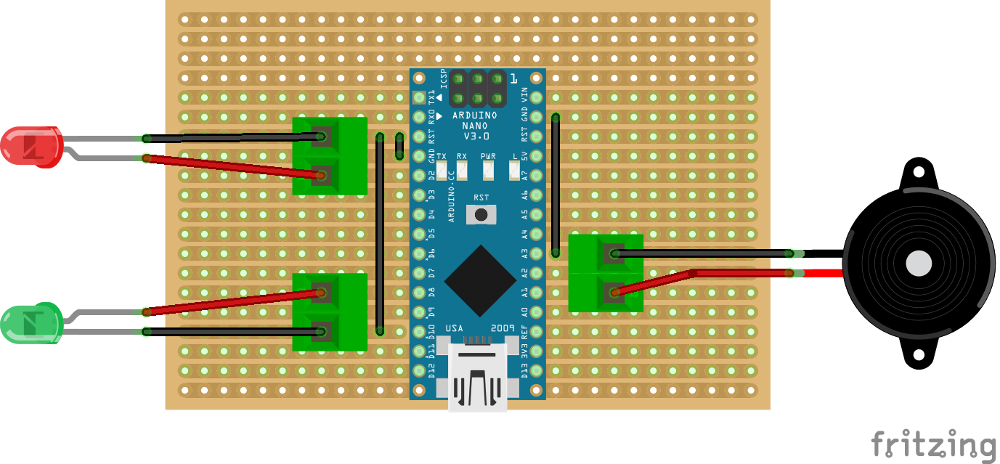

# THE SERIAL BUILD SERVER ASSISTANT

This project is a labour of love to say farewell to our friend James, and to wish him all success in his new endeavours. The cool thing about this project is that you could use it as quite a nice educational tool to teach kids about

* Electronics
* Programming
* Music

For quite a reasonable price. The code has come from a variety of sources, but I modified most of it. I have no rights to the music either, so please let me know if I need to give credit.

 

### References:
* https://www.arduino.cc/en/Tutorial/PlayMelody
* https://forum.arduino.cc/index.php?topic=412850.0
* https://www.princetronics.com/supermariothemesong/
* https://www.hackster.io/circuito-io-team/piezo-tunes-d4a011
* https://www.hackster.io/jrance/super-mario-theme-song-w-piezo-buzzer-and-arduino-1cc2e4
* https://gist.github.com/netusco/620a3ca2eb2c5029e4e97bfd00e67cc3
